# MERN Travel Blog


Deployed site on Heroku:
https://mern-travel-blog.herokuapp.com/
     
## Table of Contents

- [Description](#description)
- [Installation](#installation)
- [Usage](#usage)
- [Credits](#credits)
- [License](#license)
- [Features](#features)
- [How-to-Contribute](#how-to-contribute)
- [Tests](#tests)
- [Questions](#questions)

## Description
```md
This project was to build a responsive, interactive application using GraphQL with a node.js and express.js server, and JWT (JSON Web Token) for authentication.  We used MongoDB and the Mongoose ODM for the database, and queries and mutations for retrieving, adding, updating, and deleting data.  The application was deployed to Heroku with seed data.
```

**User Story**
```md
As a person who loves to travel
I want to share my travel experiences and learn from others’ travel experiences
SO THAT I can plan my future travel destinations
```
**Acceptance Criteria**

```md
GIVEN a MERN-stack single-page application
WHEN I visit the site for the first time
THEN I am presented with the homepage, which includes all existing reviews, as well as homepage links and navigation buttons to log in or sign up
WHEN I choose to sign up
THEN I am prompted to enter my email address, username and password, 
WHEN I complete the sign up process
THEN I am automatically logged into the site
WHEN I revisit the site at a later time and choose to log in
THEN I am prompted to enter my email and password 
WHEN I am signed into the site
THEN I am taken to the homepage that displays existing reviews, with a user profile button, a logout button and a screen to add a new review,
WHEN I enter data into the new review screen and click on the Add Review button
THEN the homepage is refreshed so I see my new review data has been saved
WHEN I click on my profile button in the navigation,
THEN I am presented with a dashboard that displays any reviews I have already created
WHEN I click on the "Edit this Review" link on any of my existing reviews
THEN I am presented with a new screen so I can change my review or I can delete the review entirely
WHEN I click on the delete review button
THEN I am able to delete my review
WHEN I return to my profile page
THEN I see my deleted review no longer exists
WHEN I click on the logout button in the navigation
THEN I am signed out of the site
WHEN I logged in but am idle on the site for more than 5 minutes
THEN I am automatically logged out and must log in again to be able to add new reviews and update/delete my existing reviews
```

## Installation  (if you are going to clone my repo)
<!-- audience is other developers -->

1. Clone this GitHub repo https://github.com/abrownstein2022/mern-travel-blog 
<!-- Check out the gh cli tool from github -->
```bash  
$ gh repo clone https://github.com/abrownstein2022/mern-travel-blog  
```

2. From the terminal, install npm:
```bash
$ npm i
``` 

<!-- [] implies user input 
 mysql> restaurant_mgr < C:\[filename].sql
-->


## Usage  
This application will be deployed on Heroku with initial seed data.  Click on the Heroku link below to start the application.  Or clone and use from your vs-code.

1. Open the app using Heroku 
https://mern-travel-blog.herokuapp.com/

Or to run localling, create 2 terminal sessions in VS Code

First terminal session to run MongoDB/Mongoose ODM
```bash
$ mongod
```

Second terminal session to run node and seed data
```bash
$ npm run seed
$ npm run develop
```

**The screenshots below show the functionality of the application:**<br>
Homepage opens for all users showing all blog reviews but no one can create reviews, or update or delete their own reviews without logging in.<br>
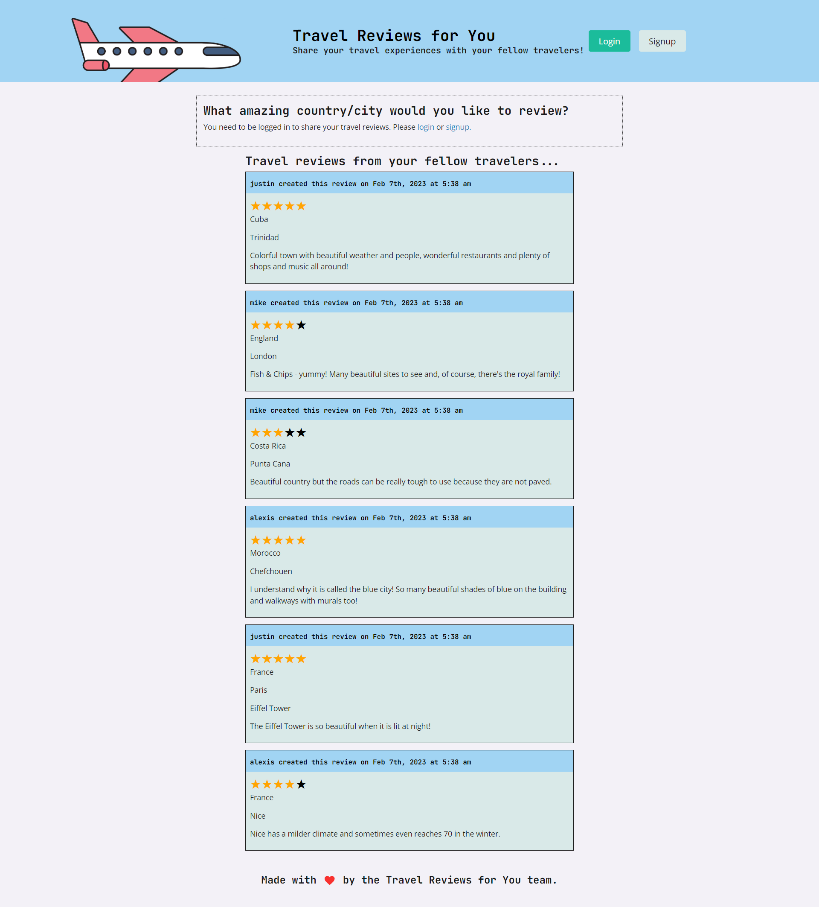

User must register on the website to create new reviews, and update or delete their existing reviews<br>
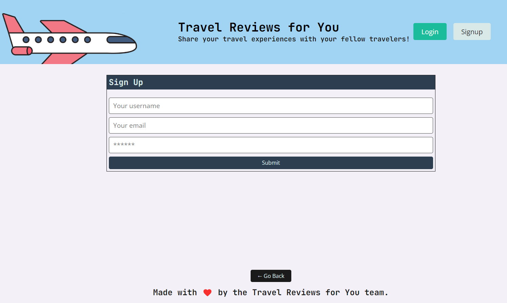

New user signup with data<br>
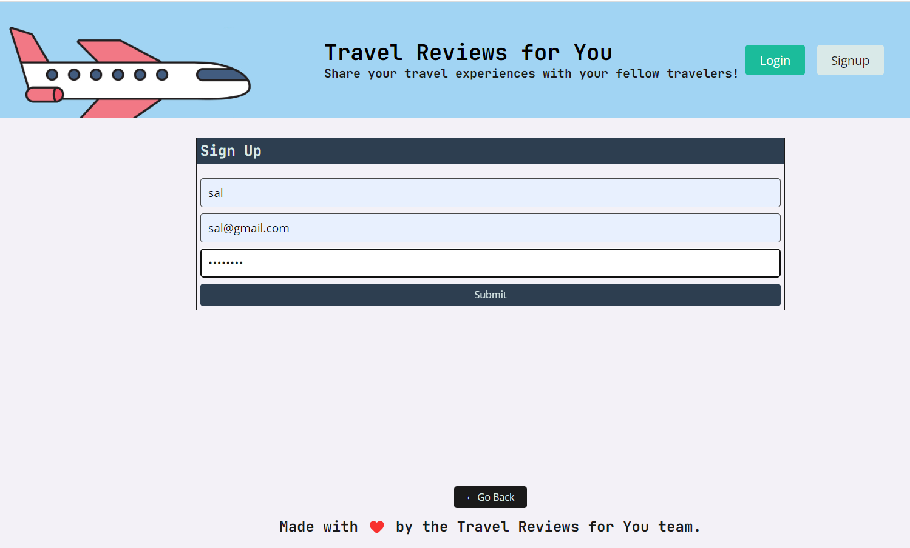

Homepage after user signup<br>
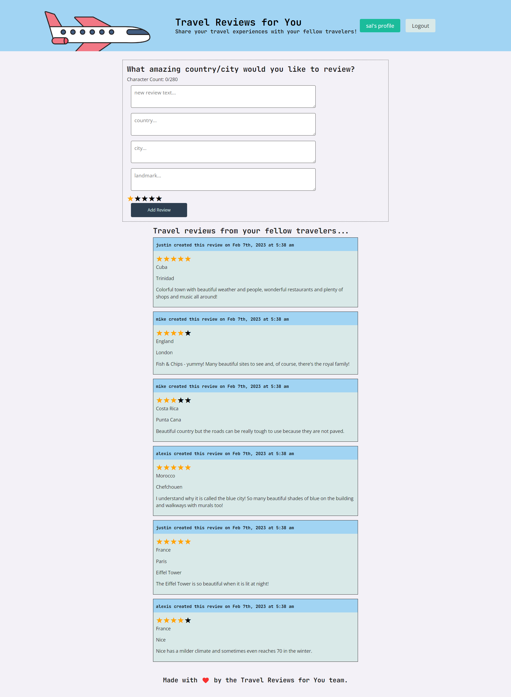

Travel blog login screen<br>
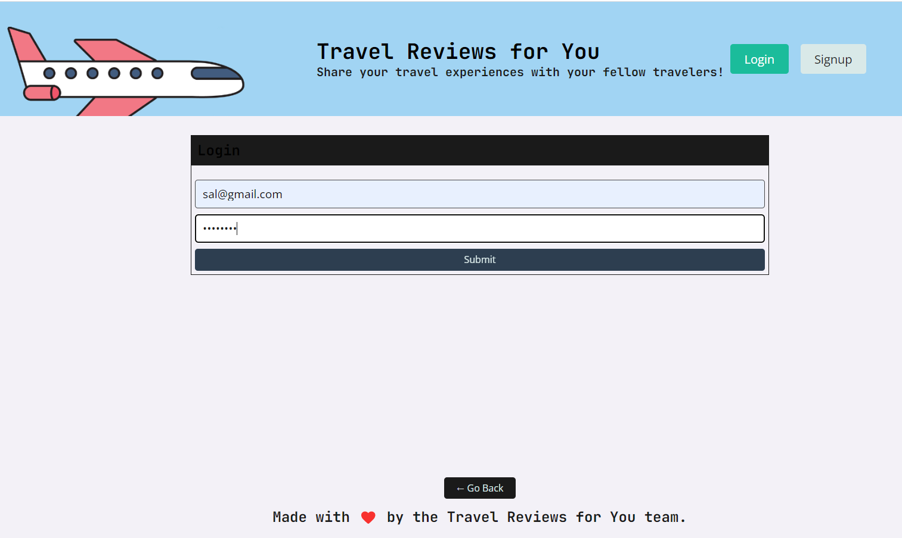

New user homepage after first blog post<br>


Travel blog add review screen before save<br>
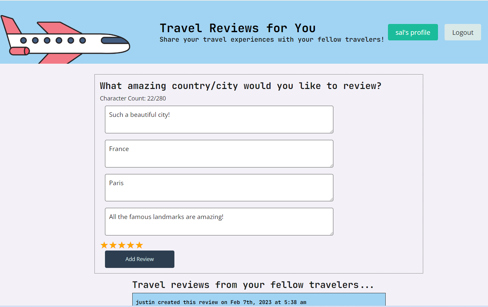

Add review screen after save<br>
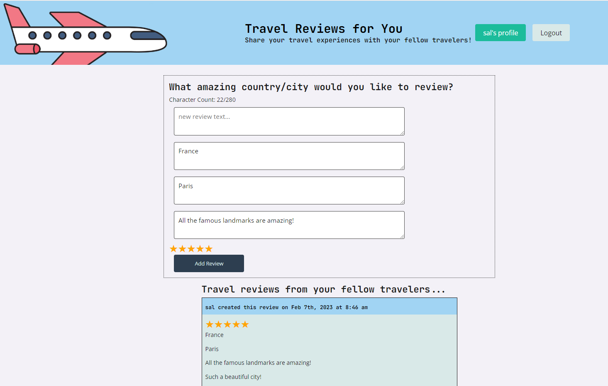

Travel blog click user profile button to see user dashboard<br>
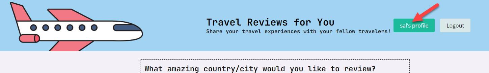

Travel blog screen after click user profile button<br>
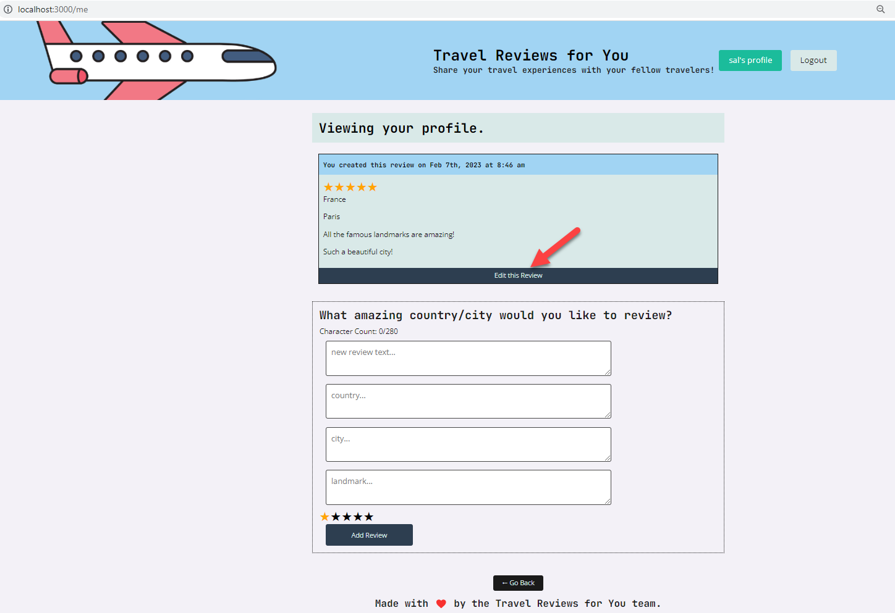

Travel blog screen after update existing review<br>
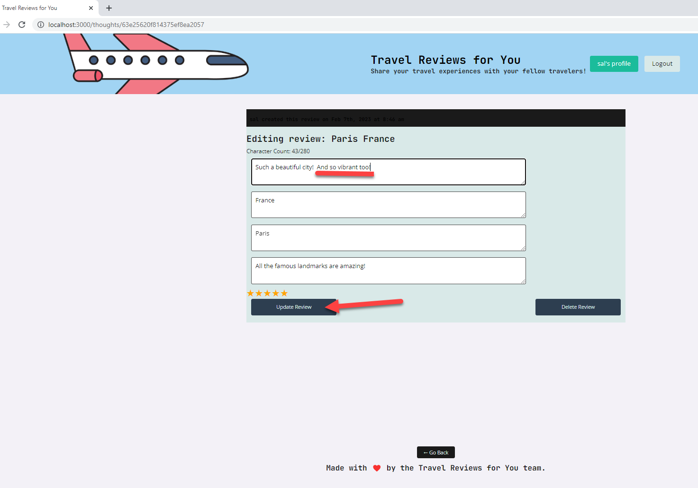

Dashboard display after update existing review and save<br>
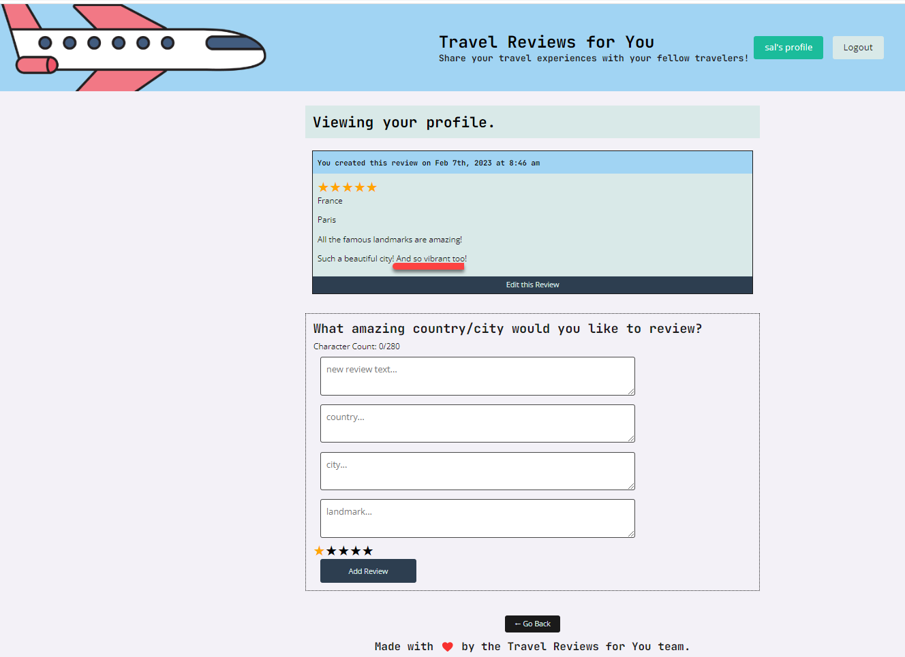

Travel blog screen before deleting existing review<br>
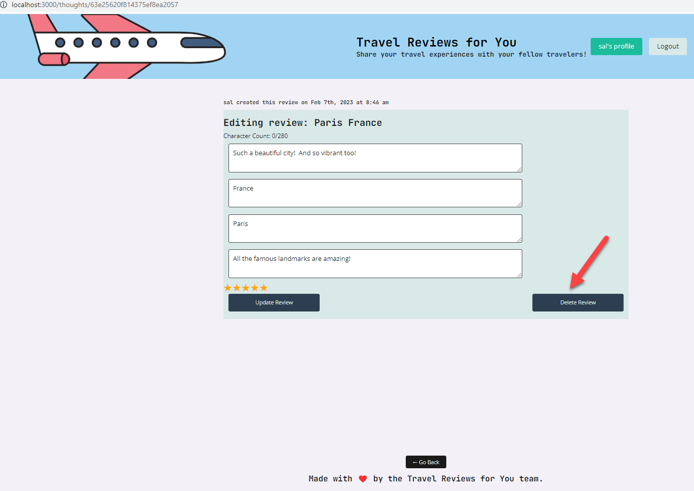

Display dashboard after new travel review has been deleted<br>
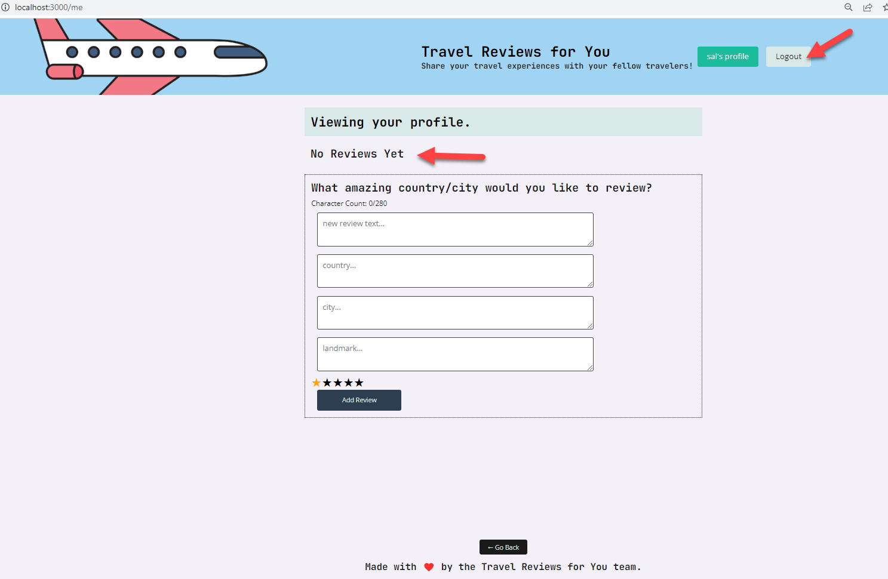
  
Travel blog screen after user clicks on logout button<br>
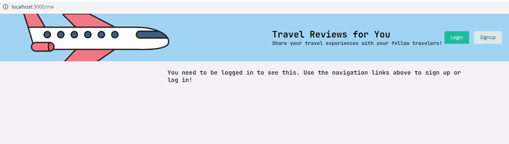

## Credits

```md
Alexis Brownstein, Bootcamp tutor: Phil, Wyzant tutor: Mike, Bootcamp teacher and TA's
```

## License

 ```md
 MIT 
```

Link to license text:
https://opensource.org/licenses/mit-license


## Features 

<!-- 
# h1
###### h6
**bold**
*italic*
_underline_

| key | value |
|-|-|
| name | 'bob' |


- list
- items

1. numberd
1. list
1. all ones - automatic numbering
Features for *future* development
 -->
**The main features in this project are:**<br> 
1. MERN stack: uses MongoDB/Mongoose ODM, Express.js, React, Node.js, JWT for authentication, Heroku for deployed website
1. Example screenshots with description of application functionality 
1. Necessary MERN folder structure and setup with client/server 
1. Professional README
1. User credentials saved to log into the site
1. Login times out after 5 minutes of inactivity
1. Responsive layout
1. Attractive and easy-to-follow layout
## How-to-Contribute

N/A

## Tests
N/A

## Questions

Feel free to contact me with any questions.

I can be reached at alexis@drdatabase.com.

This GitHub repo can be found at:
  
https://github.com/abrownstein2022/mern-travel-blog


